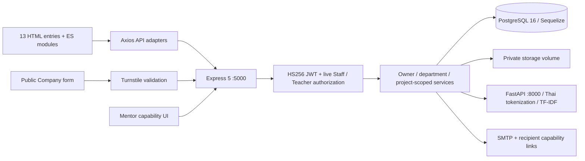

# FITM-INTERN — MORNING PROJECT STATUS

วันที่รายงาน **10 ตุลาคม 2026, Asia/Bangkok** · แหล่งหลัก: **local working tree** · รูปแบบ: **audit-only application**

ระบบมีงานเชื่อม Frontend → API → PostgreSQL จริงหลายส่วน โดยเฉพาะการยกเลิกคำร้องของเจ้าหน้าที่, document development flow, daily/weekly logs, นัดนิเทศ/ยืนยันพี่เลี้ยง/บันทึกผลสองครั้งพร้อมภาพ และปฏิทินกิจกรรม แต่ **ยังไม่พร้อมรับรอง production หรือครบ ทก.01**: ไม่พบเอกสารต้นฉบับ, schema ของฐานข้อมูลหลักยังไม่ได้ตรวจสด, PDF ทางการ/คะแนน/บางหน้าจอยังขาด และการตรวจ tablet/UX ของทุกหน้ายัง PENDING

## 1. ตัวเลขและระดับความเชื่อมั่น

| รายการ | ผล | ความหมาย / confidence |
|---|---:|---|
| ไฟล์จริงก่อนนับ audit outputs | 10,936 | inventory รวม Git/dependencies/generated/logs; สูง |
| โฟลเดอร์จริง รวม root และ generated | 1,411 | นับ directory จริง ไม่ใช่จำนวน feature; สูง |
| ไฟล์ development/config/docs ที่ทำ inventory | 360 | 336 tracked + 21 original untracked + ignored config/locks 3; สูง |
| อ่านเนื้อหาเพื่อ structural scan | 356 | 47,344 บรรทัด รวม empty files; **ไม่เท่ากับ full semantic review ทุกบรรทัด** |
| Metadata-only ใน inventory | 4 | logo PNG, 2 ignored dependency locks, local `.codex/config.toml` |
| HTML screen/entry | 13 | ตรง Vite inputs; sections ใน dashboard ไม่ได้นับเป็น HTML ใหม่ |
| Frontend page modules / API adapters / CSS | 26 / 17 / 11 | รวม shared subviews; static/build verified |
| Express API method/path | 115 | อ่าน router ที่สร้างจริง รวม role factories/loops; สูงสำหรับ registration |
| FastAPI application endpoints | 5 | health + resume-match + resume-ocr + job-matches + chat; แยกจาก OpenAPI/docs built-ins |
| Sequelize models / migration source files | 36 / 22 | migration 001–021 รวม **007a**; primary apply state UNKNOWN |
| Provisional requirements | 56 | 55 README-derived + Student account ที่ผู้ใช้ขอ; **ไม่ใช่จำนวนข้อ PDF ที่รับรองแล้ว** |
| VERIFIED / IMPLEMENTED | 10 / 13 | VERIFIED อิง historical feature-specific acceptance; ไม่รวมเป็น overall completion % |
| PARTIAL / NOT STARTED / BLOCKED | 21 / 4 / 8 | Gap รายข้ออยู่ใน traceability |
| Broad rows MOCKUP / UNKNOWN / OUT OF SCOPE | 0 / 0 / 0 | มี **UI slices MOCKUP** แยกต่างหาก; official-source reconciliation UNKNOWN |
| P0 ที่ยืนยันได้ | 0 | ไม่พบ confirmed critical exploit/data-loss ในหลักฐานที่ตรวจ; ไม่ใช่ security clearance |

## 2. ภาพรวมตามบทบาท

| Role | VERIFIED | IMPLEMENTED | PARTIAL | NOT STARTED | BLOCKED | Confidence / morning focus |
|---|---:|---:|---:|---:|---:|---|
| Student (รวม account ที่ยังไม่ทราบเลขข้อ) | 0 | 9 | 8 | 0 | 0 | กลาง: cancellation/status/daily subflows มี Chrome แต่ broad requirements ยังไม่ครบ; profile/upload/create request/advisor/matching ต้องตรวจเต็ม flow |
| Department Staff — 7 ข้อ | 2 | 0 | 3 | 2 | 0 | สูงเฉพาะ cancellation/calendar ใน disposable; docs official PDF/Company/Teacher admin/chatbot ยังมี gap |
| Teacher / supervision advisor | 5 | 2 | 3 | 1 | 5 | สูงเฉพาะ visits/identity/substitute/results; approval/advisor native UI และ rubric/PDF ยังต้องตรวจ |
| Department Head | 0 | 1 | 4 | 0 | 1 | กลาง: scoped SQL/DOM มี; native approval/management dashboard/assignment policy ยังไม่ครบ |
| Company | 0 | 1 | 1 | 1 | 0 | กลางด้าน source; live CAPTCHA/SMTP/public form acceptance ยังไม่ได้ยืนยัน |
| Mentor | 3 | 0 | 2 | 0 | 1 | สูงเฉพาะ original/appointment/substitute confirmation; attendance/final numeric assessment ยังขาด |
| Academic total score | 0 | 0 | 0 | 0 | 1 | สูงว่าขาด score engine; rubric/PDF source UNKNOWN |

**OFFICIAL SOURCE UNAVAILABLE:** ไม่พบ `.pdf`, `.doc`, `.docx` ของ ทก.01 ใน workspace; attachment เป็นคำขอ audit ไม่ใช่ต้นฉบับ. README ระบุ Staff 8 ข้อ แต่คำขอระบุ 7; จึงแยกข้อ (8) เป็น scope candidate. ไม่รับรองจำนวนข้อย่อยจริงจากเอกสารที่ไม่มีอยู่

## 3. Git baseline และการรักษางานเดิม

- Branch `main`; HEAD `846e08549e0748140714bcc164418c16063c6a78`.
- งานเดิม: **18 modified tracked paths**, **21 untracked files** (status ก่อนสร้าง audit รวม helper directory เป็นหนึ่ง entry แต่ `git ls-files --others` ขยายเป็นไฟล์จริง).
- Tracked diff: **807 insertions / 68 deletions**; `git diff --check` exit 0. LF→CRLF warnings เป็น conversion warnings ไม่ใช่ whitespace test failure.
- ไม่มี staged change จาก `git diff --cached`; ตรวจ diff ของ cancellation service, Student reason read-back, shared feedback/focus และ Staff HTML แล้ว. ส่วน diff อื่นได้รับ structural scan; semantic re-review ทุก hunk ยัง PENDING.
- รายละเอียดชื่อไฟล์/hash/status/ignored ใน [baseline.json](evidence/baseline.json). Snapshot นี้จับหลังสร้าง inventory helper ใน audit; raw status จึงมี `?? docs/audits/` ด้วย. รายการ **original** แยก audit path ออกชัดเจน.
- SHA-256 ตรวจ **363 paths** (development files 360 + secret files 3 โดยไม่อ่านค่าลงรายงาน) ไม่เปลี่ยน และ historical logs/artifacts **393 files** มี hash baseline แยก. ตรวจ preservation อีกครั้งท้าย audit.
- ไม่ reset/restore/clean/checkout ทับ, ไม่แก้ source/test assertions/acceptance เดิม, ไม่ทำ migration/deploy/commit/push/PR, ไม่เริ่ม/ลบ persistent Docker resources.

## 4. Architecture ที่พบจริง

Frontend เป็น Vite multipage HTML/ESM ไม่ใช่ SPA router. Student token อยู่ localStorage; Staff และ Teacher/Head ใช้ sessionStorage แยก namespace. `api/client.js` เปิดให้ adapters ปิด automatic Student bearer เมื่อใช้ role/capability อื่น. การจัดเก็บ token นี้ยังต้องพิจารณา XSS/session policy ก่อน deployment; ไม่พบ exploit ที่พิสูจน์แล้วในงานนี้

`app.js` register routes และ authenticate DB ตอน startup; **ไม่ sync หรือ auto-migrate schema**. `models/index.js` โหลดทุก `.model.js` และ associate หลังโหลดครบ. Umzug ledger ใช้ `sequelize_meta` และ command migration เป็น explicit operation. รายการ API/Model/Relations/Migration/Consumer/Test อยู่ใน [API/database inventory](FITM_API_DATABASE_INVENTORY_2026-10-10.md) และ [contracts.json](evidence/contracts.json)

Canonical approval ยังเป็น **Student → Class Advisor → Department Head**. Class authority ใช้ `students.advisor_teacher_id`; project/supervision ownership ใช้ `coop_advisor_teacher_id`; Head ต้องมี active DB flag และ department ตรง Class advisor. Staff ยกเลิกได้ตาม eligible state แต่ไม่มี approve/reject/forward route. ยังไม่มีการเปลี่ยน workflow ใน audit นี้

## 5. Folder review

| Folder / area | สิ่งที่ตรวจ | ข้อสรุป / gap |
|---|---|---|
| Root files | README/HANDOFF, Compose, deploy.sh, .env.example, .gitignore | Docs มี history หลายชั้น/สถานะ stale; Compose เป็น dev topology; deploy.sh เรียก migrations จึงไม่ได้รัน |
| `.codex/` | config filename/size/hash; ignored | metadata-only local tooling; ไม่ใช้เป็น product evidence |
| `backend/src/config/` — 6 | DB/storage/NLP/recruitment config; env/oauth empty | Storage lexical containment มี; empty env/oauth เป็น placeholder; no global startup env validation |
| `backend/src/controllers/` — 14 | request/auth/profile/mentor/recruitment/advisor/evaluation/role handlers | Legacy auth type/rate-limit contract อ่อนกว่าบาง service ใหม่; profile/resume acceptance ยังไม่ครบ |
| `backend/src/middlewares/` — 4 | JWT/live Staff/Teacher RBAC, upload, recruitment rate limiter | role claims + live identity recheck แข็งแรง; generic directory เป็น JWT-only; basic profile/resume MIME filter ต่างจาก strict project files |
| `backend/src/routes/` — 15 | สร้าง Express routers โดยไม่ listen/connect DB; factories 3 roles และ loop endpoints | 115 method/path registrations จริง; ไม่มี production consumer บาง Head admin/Staff jobs; ไม่ถือว่า dead route อัตโนมัติ |
| `backend/src/services/` — 27 | workflow/transaction/locks/snapshots/version/token/files/NLP/providers | ชุดใหม่มี rollback + immutable history; numeric academic scoring/official PDF absent; complete semantic review ทุก function PENDING |
| `backend/src/models/` — 37 files | 36 registered models + index; associations/fields/index metadata | persistence มีจริงตาม source; live physical constraints/ledger UNKNOWN |
| `backend/src/db/` — 24 | migrate + demo seeder + 22 migrations | latest 017–021 verified in disposable only; 010 cleanup/rollback guards inspected statically; no primary rollout claim |
| `backend/src/validators/` — 2 | UUID/allowlist/reason/page + public Company payload | Reasoned/stale mutations; strict recruitment validation; auth legacy inputs ยังควรมี dedicated tests |
| `backend/src/seeders/` — 4 | Staff creation, Teachers, Head flag, dev credential lifecycle | Operational tools mutate accounts; inventoried/scanned, **not executed**. Do not provision persistent data for audit |
| `backend/scripts/` — 15 | disposable Browser runner, scenario files/helpers; local acceptance runners | disposable ownership guards/cleanup evidence; Local runners mutate temporary rows/credentials จึงไม่ใช้ใน audit read-only |
| `backend/test/` — 46 files | all discovered safe unit definitions, database opt-ins, 4 PS runners, fixture/helper | current in-process units PASS; 17 DB-dependent roots SKIP; native canonical worker spawn blocked |
| `frontend/` HTML/config/assets | all 13 HTML titles/links/forms/scripts, Vite 13 inputs, Docker/env examples, logo metadata | `search_company.html` missing at 3 link locations; build passes since links are not imports |
| `frontend/src/api/` — 17 | adapters/contracts/bearer isolation | active adapter routes align with registered families; dynamic variants not exhaustively contract-tested across all features |
| `frontend/src/pages/` — 26 | UI orchestration/imports/state/success/error/ownership/source | homepage mock/jobs/search/chat; transfer success styling misleading; large Student module 3,804 lines; multiple historical browser flows verified |
| `frontend/src/styles/` — 11 | all source read structurally, media/overflow/class references + build | responsive rules exist; fresh desktop/tablet/mobile visual acceptance for all 13 screens still PENDING |
| `frontend/src/ui/` — 1 | shared feedback.js | confirm reason/loading/Tab wrap/Escape/opener fallback tested; alert modal lacks same Tab confinement; not every custom modal reviewed in browser |
| `frontend/test/` — 23 files | DOM fixtures/API adapters/optional SQL/browser | 253 PASS/2 SKIP current; controlled DOM does not verify CSS/Chrome rendering |
| `nlp-service/app/` | all 30 Python app files structurally; algorithm/API/model initialization reviewed | Thai/English preprocessing; TF-IDF cosine; classifier FAQ training lifespan; no Staff DB chatbot; current runtime blocked |
| `nlp-service/tests/` — 5 | 4 suites + package initializer | resume/OCR/matching/chat tests exist; pytest unavailable; TestClient lifespan setup concern not declared as freshly reproduced failure |
| `nlp-service/data/` — 7 source entries | FAQ JSON + .gitkeep metadata | FAQ is source training data; raw/models/embeddings containers are scaffolding, not evidence of learned production models |
| `docs/` — 9 pre-existing | all Acceptance docs + next-day review structural scan, feature evidence references | old acceptance snapshots preserved; report supersedes stale status for this audit only |
| `logs/` — 393 | inventory + hashes, 12 JSON summaries, final TAP/cleanup records, older relevant raw log tails, 37 PNG metadata | selected final PNGs visually inspected; not every log line or screenshot manually reviewed |
| node_modules / .git / dist / cache | counts + exclusion reasons | not first-party source review; see coverage report |

## 6. หน้าจอ: source, interaction และข้อจำกัด

Paths ใช้ origin ของ review frontend (development default `http://localhost:5173`); ทุก URL เป็น HTML จริงจาก source. API origin default `http://localhost:5000` เป็น fallback ไม่ใช่การยืนยันว่า server สดกำลังเปิด

| Entry | Role / access / menu | Components + data source | States / validation / UX evidence |
|---|---|---|---|
| `/index.html` | Public; brand/home; navbar auth switching | recommended cards, search/filter modal, chatbot; cards hardcoded; auth/me only for Student navbar | search/filter console-only; chat fixed development reply; missing company link; no full browser acceptance |
| `/login.html` | Student via navbar/sign-in | email/password form, visibility toggle, Google button; POST auth/login | submitting/loading/aria-busy/toast/error; Google placeholder; historical password login verified only |
| `/register.html` | Student via login/navbar | identity/email/password/confirm form; POST auth/register | client validation/loading/error; no full native registration acceptance; no completed OAuth registration flow |
| `/staff-login.html` | Staff via login link | Staff email/password, POST staff/auth/login | disabled/loading/status; safe active Staff profile; final Chrome login PASS |
| `/teacher-login.html` | Teacher via login link | Teacher login/profile; Teacher session bearer | safe role display/loading/auth errors; full native advisor/approval checklist pending |
| `/department-head-login.html` | Existing authorized Head via Teacher login | Head-only login service; live flag/department required | same Teacher storage family; expired role flag rejected server-side; native approval review pending |
| `/src/student_coop/student_coop.html` | Student login redirect; dashboard panels | profile/matching/request/daily/project/files/advisor/Mentor/company evaluation/transfer/calendar/supervision | most real API-backed; transfer mock; independent busy/error states; daily/status/results historic Chrome; full profile/upload/create/matching + mobile keyboard pending |
| `/src/department_staff/department_staff.html` | Staff login redirect; `#documents`, `#activities` | all-state request queue/detail/history/cancel; letters/company response; calendar | empty/error/loading/auth revocation/stale409/reason modal; final cancellation/Documents Chrome; very long mobile screen needs manual ergonomics review |
| `/src/teacher_coop/teacher_coop.html` | Teacher login; `#coopApprovals`, `#advisorRequests`, `#supervisionScheduling` | Class approval, project requests, project-owned visits, results/two photos | real APIs; ownership distinct; supervision/results Chrome historical; simultaneous mounted section auth/focus needs regression |
| `/src/department_head/department_head.html` | Head login; `#coopApprovals`; link to own Teacher duties | paged department approval queue/detail/reason | shared teacherCoopRequests controller; SQL/DOM evidence; dedicated manage/search/profile screens absent |
| `/src/recruit_student/recruit_student.html` | Public Company, **no login** | multi-position/contact/address/mode/day/allowance form + Turnstile | feature gate/rate limits/validation/loading/email delivery feedback; live CAPTCHA/inbox not verified; broken public search nav |
| `/src/recruit_student/recruit_verify_email.html` | Company email capability | verification status card; public verify API, URL cleanup | success/invalid/expired states; real recipient inbox acceptance pending |
| `/src/mentor_coop/mentor_verify_user.html` | Mentor capability, no account login | original profile confirmation **query token**, weekly review **hash review_token**, appointment **hash appointment_token** | mode-specific controllers; identity/expiry/rotate/replay protection; historical original/weekly/appointment/substitute Chrome; fresh tablet pending |

Per-screen all-button/custom-modal focus/keyboard/responsive review is **PENDING**; input placeholders and dynamically disabled buttons are not automatically unfinished work. No confirmed native `window.alert/confirm/prompt` use in current first-party source: extracted `confirm(...)` candidates are dependency aliases for shared `showConfirmModal`. See [morning checklist](FITM_MORNING_UXUI_TEST_CHECKLIST_2026-10-10.md) for execution and actual/screenshot fields

## 7. Backend/data/security findings

| ID | Priority | Evidence | Finding / proposed follow-up |
|---|---|---|---|
| F01 | P1 environment gate | Docker `version` gets named-pipe permission denied; primary ledger not inspected | Primary migration/app readiness UNKNOWN. Review on approved disposable environment; inspect primary ledger read-only separately before any later rollout |
| F02 | P1 scope blocker | no PDF + traceability grading/PDF rows | Official letters/supervision PDFs/final assessments/50–50 engine absent or BLOCKED. Obtain templates/rubrics/policy; do not substitute development HTML or Student feedback average |
| F03 | P1 function gap | index.html/recruit HTML company links; static-verification.json | Three references to missing `search_company.html`; public search path fails. Authenticated Student picker is not a public-search implementation |
| F04 | P1 incomplete integration | login.js Google placeholder; index.js timer chatbot | Google OAuth and product chatbot unavailable; Staff document-status chatbot NOT STARTED. NLP endpoint existence does not complete UI integration |
| F05 | P1 security hardening | auth.routes.js POST login/register directly; auth.controller.js `.trim()` after truthiness | Student login lacks same route rate limiter as Teacher/Staff. Non-string email/student/name payloads can become 500 instead of controlled 400. Source-confirmed gap; attack/load reproduction not performed |
| F06 | P1 deployment hardening | public `/health/db` sends `error.message`; Compose/dev Dockerfiles | health errors can expose DB diagnostics. Dev ports/services/default administrative config/reload lack a production boundary. Impact depends on network exposure; no live leak claimed |
| F07 | P2 misleading success | student_coop.js ~3751 | transfer button returns unconnected-backend message with **success** style; user can infer completion. Mark unsupported state and get scope decision in later work |
| F08 | P2 mock presentation | index.js hardcoded jobs/search/filter | Homepage fixture-like jobs are not persisted recruitment records. UI-facing sample disclosure and functional public search still needed |
| F09 | P2 consistency / hardening | upload.middleware.js; studentProfile.controller.js vs studentCoopProject.service.js | profile image/Resume rely on MIME/limits; strict project files additionally check original extension/signature/actual size/realpath. Align policies and add negative acceptance; no unsafe-file exploit claimed |
| F10 | P2 matching eligibility | jobMatching.controller.js filters only `status=published`; jobPosting.model.js has `expires_at` | A still-published expired row can be included; no explicit expiry filter or candidate volume cap found. Add expired/deterministic pagination cases before recommending live jobs |
| F11 | P2 accessibility | feedback.js showActionModal vs showConfirmModal; other custom modals | Confirm has Tab confinement/focus fallback; alert lacks same Tab confinement. Full focus restoration/keyboard testing outside cancellation/docs still PENDING |
| F12 | P2 test environment / potential test setup | pytest absent; test_chatbot.py creates TestClient without context; main lifespan trains classifier | No current NLP runtime test. Static inference: chat tests may use untrained classifier when lifespan is not entered. Reproduce in matched Python environment before treating as product defect |
| F13 | P2 stale docs | README/NEXT_DAY top says K failed while feb769 final passes | Preserve originals; this audit reconciles actual evidence to VERIFIED cancellation. Later documentation task should consolidate current truth and history |
| F14 | P3 reproducibility | .gitignore ignores package-lock.json; Docker npm install | Fresh installs can resolve differently; metadata locks exist locally but not tracked. Suggest dependency/deployment policy later; no external vulnerability scan performed |
| F15 | P3 maintainability | student_coop.js 3,804 lines; repeated Student-shape guards in coopRequest/jobMatching routes vs auth middleware | Large UI orchestration and duplicated auth contract raise regression risk. Extract only in separately authorized implementation work after behavior is covered |
| F16 | P3 unused/scaffolding candidates | backend/src/config/env.js/oauth.js empty | Empty configs are confirmed scaffolding; no automatic deletion. Dynamic models/migrations/npm scripts/HTML redirect entries are **not** dead code because a direct static import is absent |

No P0 exploit/data loss was demonstrated. This is source/acceptance audit, not a dependency CVE assessment or penetration test. Object ownership/locks/audit history appear well covered in role/cancellation/documents/new workflows; remaining concurrent profile/advisor mutation and legacy upload paths require feature-specific validation before complete security sign-off

## 8. Verification — fresh versus historical

| Evidence | PASS | FAIL | SKIP / BLOCKED | Interpretation |
|---|---:|---:|---|---|
| Fresh Backend in-process | 203 | 0 | 17 DB-dependent roots SKIP | 220 total; `node --test --test-isolation=none --test-concurrency=1`; no SQL opt-ins; [log](evidence/backend-in-process-tests.log) |
| Fresh Frontend in-process | 253 | 0 | 2 optional roots SKIP | 255 total; controlled DOM/API adapters; [log](evidence/frontend-in-process-tests.log) |
| Fresh canonical isolated Node runner | — | — | BLOCKED, command exit 1 (spawn EPERM) | [Backend attempt](evidence/backend-safe-tests.log), [Frontend attempt](evidence/frontend-safe-tests.log); no completed canonical suite claim |
| Fresh frontend build | 123 modules | 0 | — | 13 HTML inputs; output **only audit evidence/frontend-build/**; native config loader; [log](evidence/frontend-build.log) |
| Fresh JS / Python syntax | 258 / 35 files | 0 | — | `node --check`, `ast.parse`; no Python runtime/dependency inference; [verification](evidence/static-verification.json) |
| Fresh PowerShell parse | 4 files | 0 | — | AST only; scripts not executed; [parse evidence](evidence/powershell-syntax.json) |
| Fresh NLP pytest | — | — | BLOCKED, no pytest, exit 1 | [log](evidence/nlp-tests.log); no test assertions executed |
| Fresh Compose parse | config exit 0 | 0 | root POSTGRES_PASSWORD unset warning | `docker compose config --quiet`; no startup/engine mutation |
| Fresh SQL / Chrome / manual review | — | — | NOT RUN / BROWSER NOT VERIFIED | Docker denied; existing artifacts reviewed; no fresh E2E screenshots claimed |
| Historical final cancellation | 28 Chrome scenarios | 0 | 0 | feb769… final, actual Chrome/154.0.8037.98; distinct from Documents scenarios |
| Historical final Documents | 13 Chrome scenarios | 0 | 0 | same final invocation, development HTML only |
| Historical final focused SQL | 46 | 0 | 0 | overlaps Backend full |
| Historical final Backend | 426 | 0 | 0 | SQL opt-ins enabled in owned disposable runners |
| Historical final Frontend | 258 | 0 | 1 | skipped standalone prerequisite browser fixture explicitly identified |

Do **not** sum overlapping focused/full/historical/current counts into unique coverage. Current in-process mode shares process/module cache; it is recorded separately from canonical isolated workers and does not replace the historical integrated suite. Backend fixture/process controller tests passed in-process even though asynchronous Node test-worker launch was blocked

Final run `feb769…` executed **2026-10-10 00:36:33–00:57:28 Bangkok** (JSON UTC 2026-10-09 17:36–17:57). All 9 stage records and process exits are 0. Read-only audit invoked `validateBrowser`, parsed the actual TAP and checked 5 cleanup ownership records; it **did not invoke `validateEvidence` CLI**, which would overwrite old `test-counts.json`. Live Docker cleanup cannot be rechecked now; historical independent cleanup stage was PASS

37 historical PNGs have valid signature/dimensions; selected Staff cancellation mobile, Student cancellation modal mobile, calendar mobile and Teacher result draft mobile were visually inspected. They show fixture data and long page/modal content; they cannot prove all screens or current deployment are responsive. Student modal screenshot is only the visible scroll area, not proof that every detail is present in that screenshot

## 9. งานตอนเช้าและรายงานทั้งหมด

เริ่มที่ environment gate/approved test identities แล้วตรวจ **Student create → Class decision → Head decision → Student status**, Staff cancellation reason + stale409 + keyboard, development letters/Company Response, daily → Mentor weekly review, visits/results/two images, public form/CAPTCHA, matching/OCR. ตรวจ desktop/tablet/mobile และ capture Actual/Screenshot/Network status ตาม [checklist](FITM_MORNING_UXUI_TEST_CHECKLIST_2026-10-10.md)

ลำดับพัฒนาถัดไปอยู่ใน [priority report](FITM_NEXT_DEVELOPMENT_PRIORITY_2026-10-10.md); รายข้ออยู่ใน [traceability](FITM_SCOPE_TRACEABILITY_2026-10-10.md); ทุก development file อยู่ใน [CSV](FITM_FILE_INVENTORY_2026-10-10.csv); ข้อที่ยังไม่ตรวจเชิงลึกและ exclusions อยู่ใน [coverage](FITM_AUDIT_COVERAGE_2026-10-10.md)

**สถานะ audit: inventory/structural scan/report preparation เสร็จ; full semantic review ทุก source function, official PDF reconciliation, primary DB/live providers และ fresh all-screen UX/UI ยัง PENDING.** ไม่สรุปเป็น COMPLETE repository acceptance จากจำนวนไฟล์หรือผล unit tests
